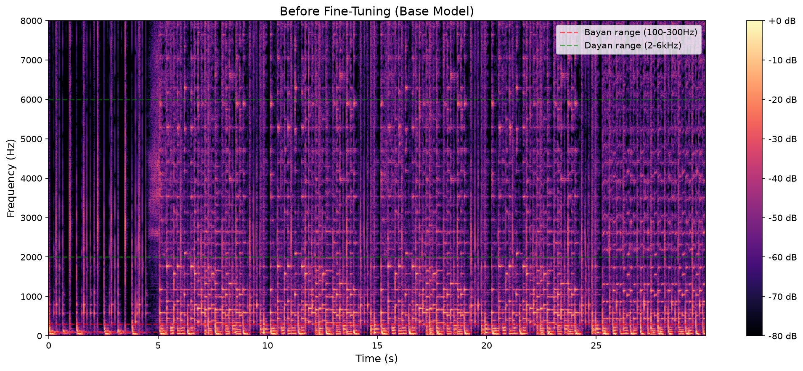
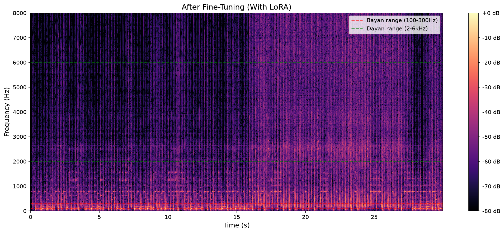
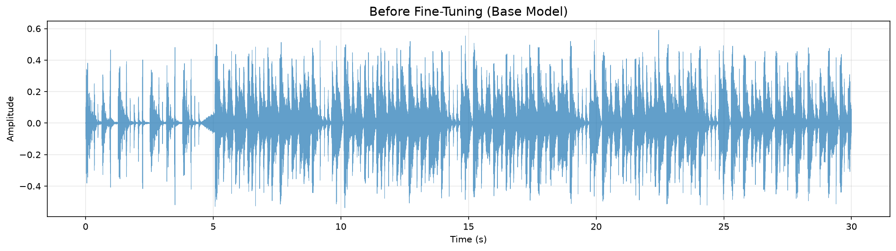
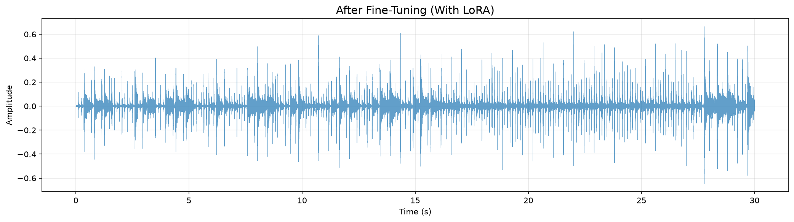
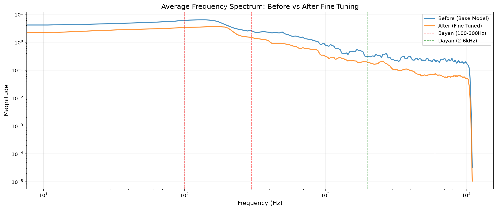

# Audio LoRA Fine-Tuning

> A systematic framework for fine-tuning large music generation models on niche instruments with limited data.

## Overview

This repository documents the methodology, infrastructure, and results of fine-tuning [ACE-Step 1.5](https://github.com/ACE-Step/ACE-Step-1.5) — a 4B-parameter DiT-based music model — on **niche, underrepresented instruments** using limited data (30–60 minutes per instrument).

**Current Case Study:** Tabla (completed)  
**Planned:** Bansuri, Sitar, Shehnai, Tanpura

## Why This Matters

| Problem | Solution |
|---------|----------|
| Foundation models don't understand niche instruments | LoRA fine-tuning with 30–60 min of audio |
| Mixed-instrument recordings (tabla + sitar) | Stem separation with Demucs |
| Inconsistent captioning | Custom annotation tool with structured descriptors |
| Reproducibility | Documented pipeline + configs |
| Resource constraints | Optimized for RTX 3090 (24GB) |

🎵 Case Study: Tabla (Completed)
We successfully fine-tuned ACE-Step 1.5 to generate recognizable tabla using a highly efficient approach.

Data: 51 carefully curated clips (30-45s) from 1.5 hours of raw audio.

Method: DoRA adapter (rank 128, alpha 240) with structured captions.

Result: 62.3% loss reduction and clear timbre separation (bayan/dayan).

Key Visual Proof:

## Spectogram

<table>
  <tr>
    <td> <em>Before (Base Model)</em></td>
    <td> <em>After (Fine-Tuned)</em></td>
  </tr>
</table>

## Waveform

<table>
  <tr>
    <td> <em>Before (Base Model)</em></td>
    <td> <em>After (Fine-Tuned)</em></td>
  </tr>
</table>

## Frequency Spectrum 
<!-- Image with a caption -->

  
   
  <em>Figure 1: Average frequency spectrum before vs after fine-tuning</em>

## Full Case Study

[Read the full Tabla Case Study →](docs/case_studies/tabla/tabla.md)

## Sample Audio
**Before (Base Model):**
<audio controls>
  <source src="docs/case_studies/tabla/results/prompt_1_sample_1_before.mp3" type="audio/wav">
  Your browser does not support the audio element.
</audio>
<audio controls>
  <source src="docs/case_studies/tabla/results/prompt_1_sample_1_after.mp3" type="audio/wav">
  Your browser does not support the audio element.
</audio>
[▶️ Before Audio](docs/case_studies/tabla/results/prompt_1_sample_1_before.mp3)

**After (Fine-Tuned):**
[▶️ After Audio](docs/case_studies/tabla/results/prompt_1_sample_1_after.mp3)

> 💡 **Tip:** Download the files to your local machine for the best listening experience. 
> The difference is most noticeable in the bayan (bass) and dayan (treble) separation.
> The Prompts used can be found at [Prompts](docs/case_studies/tabla/prompts.md)

## Technical Stack

- **Model:** ACE-Step 1.5 (4B DiT) — `acestep-v15-base`
- **Adapter:** DoRA (rank 128, alpha 240)
- **Framework:** Side-Step (corrected timestep sampling + CFG dropout)
- **Infrastructure:** RunPod (RTX 3090, 24GB VRAM)
- **Data Tools:** Custom annotation CLI, Demucs for stem separation
- **Analysis:** Loss curves, spectrograms, frequency analysis

## Key Technical Contributions

1. **Data Curation Pipeline** — From raw recordings to annotated, preprocessed tensors
2. **Annotation Framework** — Structured descriptors (tempo, energy) for consistent captioning
3. **Training Optimization** — DoRA + min_snr loss + CFG dropout = stable, high-quality learning
4. **Infrastructure as Code** — Reproducible RunPod setup with UV and Side-Step
5. **Comparative Analysis** — Before/after spectrograms and other relevant metrics

## Results (Tabla Case Study)

| Metric | Before | After | Improvement |
|--------|--------|-------|-------------|
| Loss | 0.5765 | 0.2173 | **62.3%** |
| Timbre Accuracy | Generic percussion | Tabla-specific (bayan/dayan) | Qualitative |
| Trigger Word | None | `tablastyle` | Enables style control |

## Project Structure

See [docs/methodology.md](docs/methodology.md) for detailed walkthroughs.

Every case study includes:
- `configs/<instrument>.yaml` 
- `scripts/` — annotation, analysis
- `docs/case_studies/instrument` — methodology and infrastructure
- `docs/case_studies/instrument/results` — results, analysis reports, samples.

## License

MIT

## Acknowledgments

- [ACE-Step](https://github.com/ACE-Step/ACE-Step-1.5) — Foundation model
- [Side-Step](https://github.com/koda-dernet/Side-Step) — Training framework
- [RunPod](https://runpod.io) — GPU infrastructure
